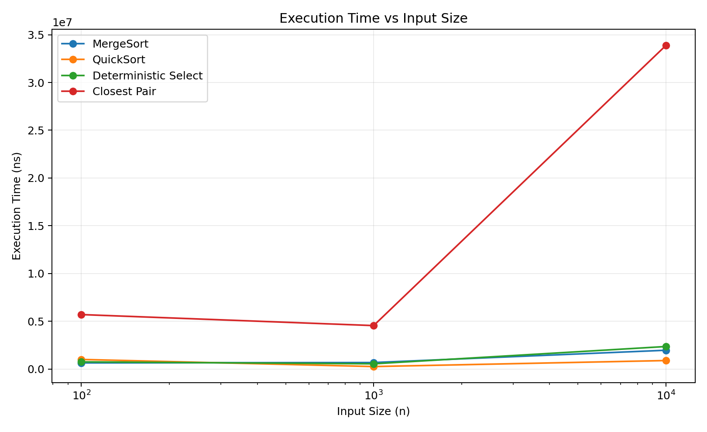
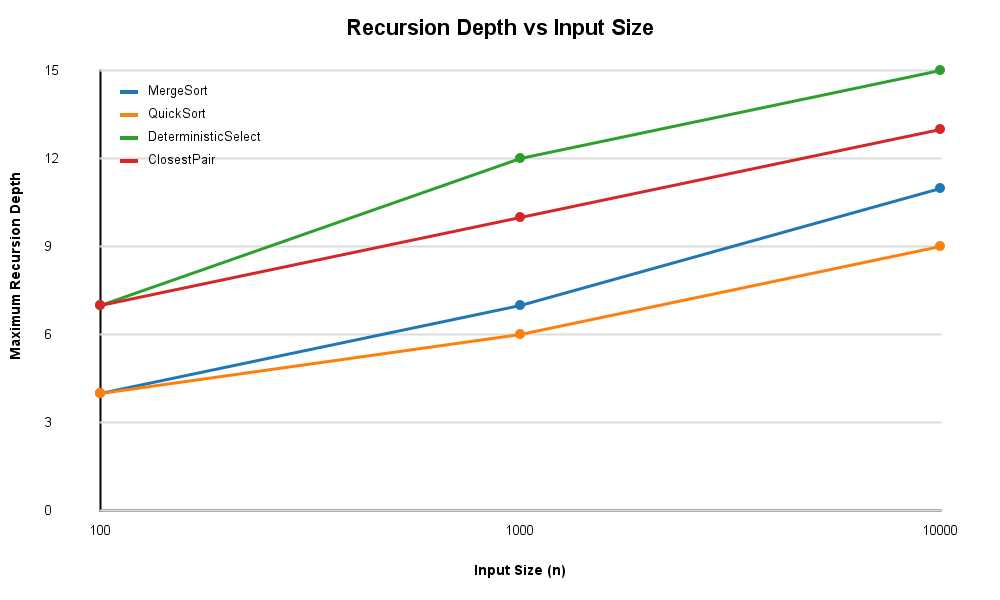

# Assignment 1: Divide-and-Conquer Algorithm Analysis

## Project Overview

This project implements and analyzes four divide-and-conquer algorithms in Java:

1. Merge Sort
2. Randomized Quick Sort
3. Deterministic Select (Median of Medians)
4. Closest Pair of Points

The purpose of the project is to compare theoretical complexity with practical experimental results. The experiments measure execution time, maximum recursion depth, and the number of comparisons.

---

## 1. Merge Sort

Merge Sort divides the array into two halves, recursively sorts both halves, and merges the sorted parts.

A reusable auxiliary buffer is used during merging. For small subarrays, the implementation switches to Insertion Sort with a cutoff of 16 elements.

### Complexity

Recurrence:

T(n) = 2T(n/2) + O(n)

Using the Master Theorem:

Time complexity: **Theta(n log n)**

Space complexity: **O(n)**

The recursion depth is **O(log n)**.

---

## 2. Randomized Quick Sort

Quick Sort selects a random pivot and partitions the array in place.

To reduce stack depth, the implementation recursively processes the smaller partition and processes the larger partition iteratively.

### Complexity

Typical recurrence:

T(n) = T(k) + T(n-k-1) + O(n)

Expected time complexity: **O(n log n)**

Worst-case time complexity: **O(n^2)**

Typical recursion depth: **O(log n)** because the smaller partition is processed recursively.

---

## 3. Deterministic Select

Deterministic Select finds the k-th smallest element without sorting the entire array.

The algorithm:

1. Divides elements into groups of five.
2. Finds the median of each group.
3. Uses the median of medians as the pivot.
4. Partitions the array in place.
5. Recurses only into the partition containing the required element.

A three-way partition is used to handle duplicate values.

### Complexity

The recurrence can be written approximately as:

T(n) <= T(n/5) + T(7n/10) + O(n)

Using the Akra-Bazzi idea, the linear partitioning work dominates.

Worst-case time complexity: **Theta(n)**.

---

## 4. Closest Pair of Points

The Closest Pair algorithm finds the minimum Euclidean distance between two points.

First, the points are sorted by their x-coordinate. The set is recursively divided into two halves. After solving the left and right halves, a strip around the dividing line is checked in y-order.

### Complexity

Recurrence:

T(n) = 2T(n/2) + O(n)

Therefore:

Time complexity: **Theta(n log n)**

Additional space is required for temporary arrays used during merging and strip processing.

---

# Experimental Setup

The algorithms were implemented in Java and measured using `System.nanoTime()`.

Three input sizes were used:

- Small: n = 100
- Medium: n = 1000
- Large: n = 10000

For array algorithms, the following input types were tested:

- Random
- Sorted
- Reverse sorted
- Duplicate-heavy

The following metrics were collected:

- Execution time in nanoseconds
- Maximum recursion depth
- Number of comparisons

The complete experimental data is available in:

`results/results.csv`

---

# Experimental Results

## Random Input

| Algorithm | n = 100 | n = 1000 | n = 10000 |
|---|---:|---:|---:|
| Merge Sort | 647100 ns | 686600 ns | 1973000 ns |
| Quick Sort | 1009800 ns | 265400 ns | 894600 ns |
| Deterministic Select | 756500 ns | 553100 ns | 2363500 ns |
| Closest Pair | 5706300 ns | 4554300 ns | 33883800 ns |

Single-run timing measurements can fluctuate because of JVM warm-up, system scheduling, and other runtime effects. Therefore, the measured values are used mainly to observe general scaling behavior rather than exact performance.

## Maximum Recursion Depth on Random Input

| Algorithm | n = 100 | n = 1000 | n = 10000 |
|---|---:|---:|---:|
| Merge Sort | 4 | 7 | 11 |
| Quick Sort | 4 | 6 | 9 |
| Deterministic Select | 7 | 12 | 15 |
| Closest Pair | 7 | 10 | 13 |

---

# Plots

## Execution Time vs Input Size



## Recursion Depth vs Input Size



---

# Discussion

### How does input order affect Merge Sort and Quick Sort?

Merge Sort has similar asymptotic complexity for different input orders because it always divides the input into two halves. However, the number of comparisons and measured execution time can still change.

Randomized Quick Sort is less dependent on the original order than a version that always chooses a fixed pivot. Random pivot selection reduces the probability of repeatedly producing highly unbalanced partitions.

The duplicate-heavy input produced a large number of comparisons for Quick Sort. For n = 10000, the experiment recorded 5,060,574 comparisons. This happens because the current Quick Sort partition uses a two-way partition and many values can be equal to the pivot.

### How does recursion depth change with input size?

For Merge Sort, the measured maximum depth increased from 4 at n = 100 to 11 at n = 10000.

For Closest Pair, it increased from 7 to 13.

This is consistent with logarithmic recursion growth in divide-and-conquer algorithms.

Quick Sort also maintained a relatively small recursion depth because the implementation recursively processes only the smaller partition.

### Theory vs Practical Results

The experimental results generally follow the expected growth patterns, but execution time does not increase perfectly at every step.

For example, some n = 1000 measurements were faster than n = 100 measurements. This can happen because the experiment uses single timing runs and Java execution is affected by JVM warm-up, JIT compilation, operating-system scheduling, and measurement noise.

The recursion-depth results are more stable and clearly demonstrate the expected divide-and-conquer structure.

---

# Testing

Merge Sort and Quick Sort were compared with Java's `Arrays.sort()`.

The tests included:

- Random arrays
- Sorted arrays
- Reverse-sorted arrays
- Duplicate values
- Empty arrays
- Single-element arrays

Deterministic Select was tested on 100 random cases and compared with the k-th element of an array sorted using `Arrays.sort()`.

Closest Pair was tested on 100 random point sets and compared with an O(n^2) brute-force implementation.

All implemented algorithms passed the tests.

Screenshots of program output and testing are stored in:

`docs/screenshots/`

---

# Reflection

This assignment helped me understand how divide-and-conquer algorithms work not only theoretically but also in real implementations. Before implementing the algorithms, complexity such as O(n log n) was mostly a theoretical concept. Measuring execution time, recursion depth, and comparisons made the differences between the algorithms easier to understand.

The most interesting part was seeing that practical execution time does not always increase perfectly with input size. Runtime measurements can be affected by the JVM and the computer environment. I also observed that input characteristics, especially many duplicate values, can strongly affect Quick Sort even when a randomized pivot is used.

---

# Project Structure

```text
assignment1-divide-and-conquer/
├── src/
│   └── main/
│       └── java/
│           ├── MergeSorter.java
│           ├── QuickSorter.java
│           ├── DeterministicSelector.java
│           ├── ClosestPairSolver.java
│           ├── Experiment.java
│           ├── Point.java
│           └── Main.java
├── tests/
├── docs/
│   ├── screenshots/
│   └── plots/
├── results/
│   └── results.csv
├── README.md
├── pom.xml
└── .gitignore
```

## Technologies

- Java 17
- IntelliJ IDEA
- Maven
- Git
- GitHub